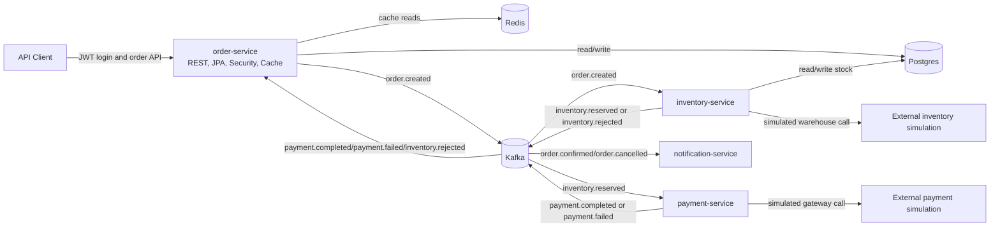
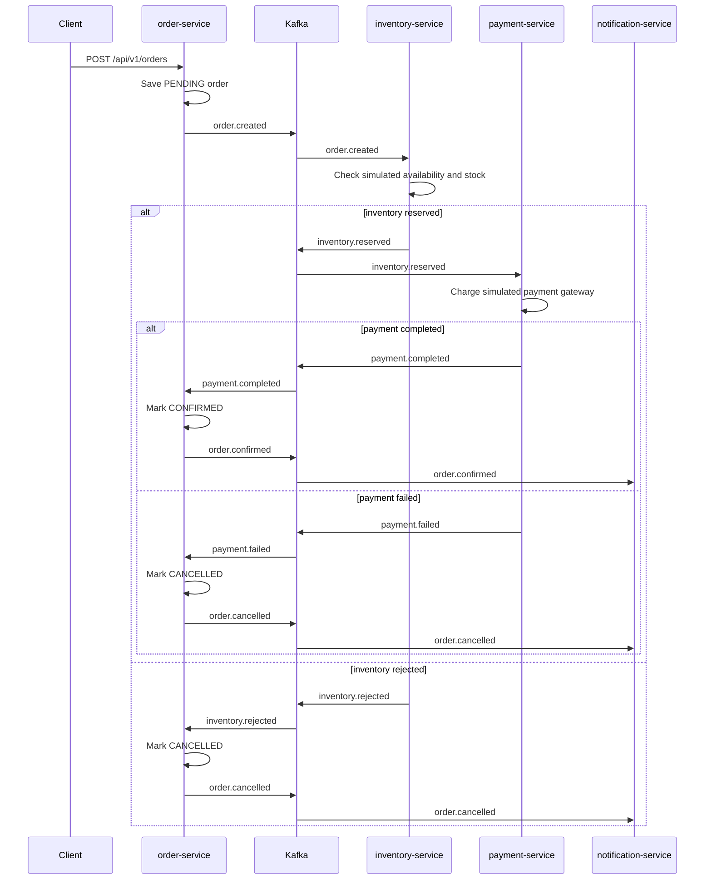

# Order SAGA Platform

Production-style Spring Boot assessment project for an order processing workflow coordinated with Kafka-based SAGA events. The repository is organized as a Java 21 multi-module Maven build with shared contracts, an authenticated order API, inventory and payment participants, notification consumers, Redis caching, Resilience4j fault-tolerance, OpenAPI documentation, and JaCoCo coverage gates.

## Assessment Checklist

| Requirement | Status | Where |
| --- | --- | --- |
| Java 21 multi-module Maven project | Implemented | Root `pom.xml`, service modules |
| Shared common contracts | Implemented | `common` |
| Order REST API | Implemented | `order-service` |
| JWT authentication and role authorization | Implemented | `order-service/security`, `order-service/auth` |
| Kafka SAGA events | Implemented | order, inventory, payment, notification listeners/publishers |
| Redis caching | Implemented for order reads | `order-service/config/CacheConfig.java` |
| Resilience4j circuit breaker and retry | Implemented for simulated external inventory/payment clients | `inventory-service`, `payment-service` |
| Request/response logging | Implemented with AOP and sanitization | `order-service/logging` |
| OpenAPI/Swagger | Implemented for order-service | `OpenApiConfig.java` |
| Unit and integration-style tests | Implemented | `src/test` in all modules |
| JaCoCo coverage gate | Implemented | Root `pom.xml` |

## Architecture



More detail: [docs/architecture.md](docs/architecture.md).

## SAGA Flow



More detail: [docs/saga-flow.md](docs/saga-flow.md).

## Modules

- `common`: shared enums, DTOs, event records, Kafka topic constants, and reusable exceptions.
- `order-service`: REST API, JWT auth, order persistence, Kafka publishing/consuming, Redis cache, OpenAPI, AOP logging.
- `inventory-service`: consumes `order.created`, checks simulated external availability, updates stock, publishes inventory results.
- `payment-service`: consumes `inventory.reserved`, calls simulated payment gateway, publishes payment results.
- `notification-service`: consumes final order events and logs notification messages.

## Tech Stack

- Java 21
- Spring Boot 3.5.16
- Spring Web, Validation, Security, Data JPA, Data Redis, Cache, Actuator, AOP
- Spring Kafka
- PostgreSQL
- Redis
- Kafka
- JJWT
- Springdoc OpenAPI
- Resilience4j circuit breaker and retry
- JUnit 5, Mockito, Spring Boot Test, Testcontainers
- JaCoCo

## Run With Docker

`docker-compose.yml` starts infrastructure only:

```powershell
docker compose up -d
```

Services exposed by Docker Compose:

- Postgres: `localhost:5432`
- Redis: `localhost:6379`
- Kafka: `localhost:9092`
- Kafka UI: `http://localhost:8085`

The Spring Boot services are run from source. Start only the services you need:

```powershell
.\order-service\mvnw.cmd -f order-service\pom.xml spring-boot:run
.\inventory-service\mvnw.cmd -f inventory-service\pom.xml spring-boot:run
.\payment-service\mvnw.cmd -f payment-service\pom.xml spring-boot:run
.\notification-service\mvnw.cmd -f notification-service\pom.xml spring-boot:run
```

Current application configs use local Postgres URLs. Before running all services, make sure the configured databases and credentials exist:

- `order-service`: `jdbc:postgresql://localhost:5432/order_saga`
- `inventory-service`: `jdbc:postgresql://localhost:5432/inventory_saga`

The compose file creates `order_saga` with user/password `order_saga`. Either align the service YAML files for local development or create matching local users/databases for the checked-in YAML values.

## Build And Test

Run the full reactor build:

```powershell
.\order-service\mvnw.cmd -f pom.xml clean verify
```

Run one module:

```powershell
.\order-service\mvnw.cmd -f pom.xml -pl order-service test
```

Run with installation to the local Maven repository:

```powershell
.\order-service\mvnw.cmd -f pom.xml clean install
```

## Swagger URLs

When `order-service` is running:

- Swagger UI: `http://localhost:8081/swagger-ui.html`
- OpenAPI JSON: `http://localhost:8081/v3/api-docs`

## Demo Credentials

Use `POST /api/v1/auth/login` with an in-memory demo user:

| Username | Password | Role |
| --- | --- | --- |
| `customer` | `customer123` | `CUSTOMER` |
| `admin` | `admin123` | `ADMIN` |
| `service` | `service123` | `SERVICE` |

`CUSTOMER` and `ADMIN` can call order API endpoints. `SERVICE` is available as a demo role but is not authorized for the order REST API.

## Sample Curl Commands

Login:

```bash
curl -X POST http://localhost:8081/api/v1/auth/login \
  -H "Content-Type: application/json" \
  -d '{"username":"customer","password":"customer123"}'
```

Create an order:

```bash
curl -X POST http://localhost:8081/api/v1/orders \
  -H "Content-Type: application/json" \
  -H "Authorization: Bearer <token>" \
  -d '{
    "customerId": "aaaaaaaa-aaaa-aaaa-aaaa-aaaaaaaaaaaa",
    "items": [
      {
        "productId": "11111111-1111-1111-1111-111111111111",
        "quantity": 2,
        "unitPrice": 25.50
      }
    ]
  }'
```

Get an order:

```bash
curl http://localhost:8081/api/v1/orders/<orderId> \
  -H "Authorization: Bearer <token>"
```

Get customer orders:

```bash
curl "http://localhost:8081/api/v1/orders/customers/aaaaaaaa-aaaa-aaaa-aaaa-aaaaaaaaaaaa?page=0&size=10" \
  -H "Authorization: Bearer <token>"
```

More API notes: [docs/api-guide.md](docs/api-guide.md).

## Kafka Topics

| Topic | Producer | Consumer |
| --- | --- | --- |
| `order.created` | order-service | inventory-service |
| `inventory.reserved` | inventory-service | payment-service |
| `inventory.rejected` | inventory-service | order-service |
| `payment.completed` | payment-service | order-service |
| `payment.failed` | payment-service | order-service |
| `order.confirmed` | order-service | notification-service |
| `order.cancelled` | order-service | notification-service |
| `inventory.released` | Shared constant only | Not wired yet |
| `payment.refunded` | Shared constant only | Not wired yet |

## Redis Caching

`order-service` enables Spring Cache backed by Redis:

- Cache `orders`: used by `getOrder(UUID)`, TTL 30 minutes.
- Cache `customerOrders`: used by `getCustomerOrders(UUID, Pageable)`, TTL 5 minutes.
- Default cache TTL is 10 minutes.
- Null values are not cached.

Order confirmation and cancellation evict the single-order cache entry.

## Resilience4j

The participant services wrap simulated external dependencies with circuit breaker and retry:

- `inventory-service`: `InventoryAvailabilityClient.checkAvailability(...)`
- `payment-service`: `PaymentGatewayClient.chargePayment(...)`

Both clients have fallbacks that return `false`, allowing the SAGA to reject inventory or fail payment instead of throwing through the listener.

## Test Coverage

JaCoCo is configured in the root Maven build with bundle-level gates:

- Line coverage minimum: `0.90`
- Branch coverage minimum: `0.80`

Run:

```powershell
.\order-service\mvnw.cmd -f pom.xml clean verify
```

Reports are generated under each module's `target/site/jacoco` directory.

More detail: [docs/testing.md](docs/testing.md).

## Production Considerations

- Replace demo in-memory users with a real identity provider or user service.
- Move JWT secrets and database credentials to a secret manager or environment-specific configuration.
- Add database migrations with Flyway or Liquibase.
- Add idempotency and duplicate event handling for Kafka consumers.
- Add transactional outbox or reliable publish strategy for order events.
- Add dead-letter topics and retry policies for failed Kafka messages.
- Split Postgres schemas/databases and credentials per service.
- Add observability dashboards, structured logs, and distributed tracing.
- Review Redis cache invalidation for every future order mutation.
- Add container images and service definitions if the application services should run fully through Docker Compose or Kubernetes.
