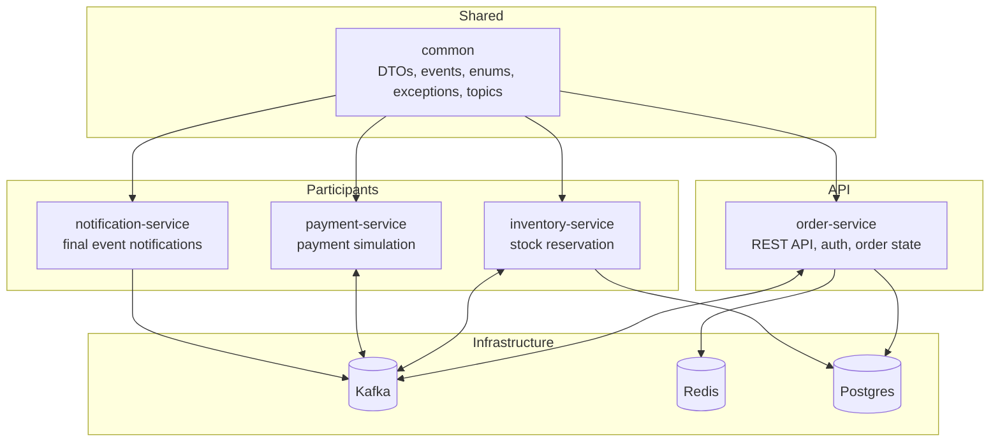

# Architecture

The platform is a multi-module Spring Boot project. The root Maven build coordinates shared contracts and four application services.

## Logical Components

## Service Responsibilities

| Module | Responsibility |
| --- | --- |
| `common` | Stable contracts shared by all services. |
| `order-service` | Owns order API, authentication, order persistence, status transitions, cache, and SAGA orchestration reactions. |
| `inventory-service` | Consumes order creation events, checks simulated warehouse availability, reserves stock, and emits inventory outcomes. |
| `payment-service` | Consumes inventory reservation events, calls a simulated payment gateway, and emits payment outcomes. |
| `notification-service` | Consumes final order events and logs notification messages. |

## Runtime Ports

| Component | Port |
| --- | --- |
| order-service | `8081` |
| inventory-service | `8082` |
| payment-service | `8083` |
| notification-service | `8084` |
| Kafka UI | `8085` |
| Postgres | `5432` |
| Redis | `6379` |
| Kafka | `9092` |

## Data Ownership

`order-service` owns order and order item state. `inventory-service` owns inventory stock state. `payment-service` currently simulates payment processing and does not persist payment records. `notification-service` currently logs notifications and does not persist notification history.

## Security Boundary

Only `order-service` exposes the documented REST API. JWT authentication is stateless. The login endpoint and Swagger/health endpoints are public; order endpoints require `CUSTOMER` or `ADMIN`.

## Infrastructure Notes

`docker-compose.yml` provides Postgres, Redis, Kafka, and Kafka UI. Application services are currently run from source with Maven. The compose file does not build or run the Spring Boot services.
