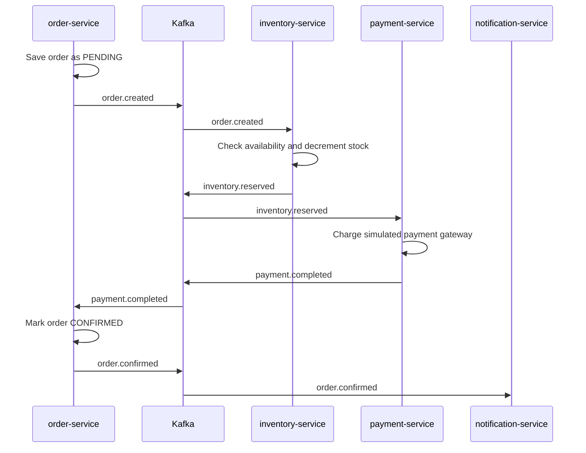
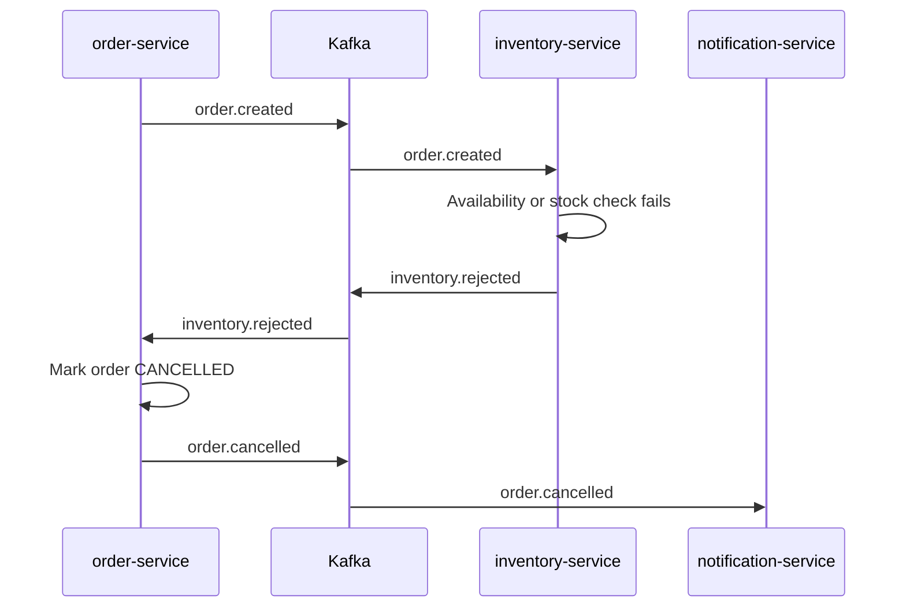
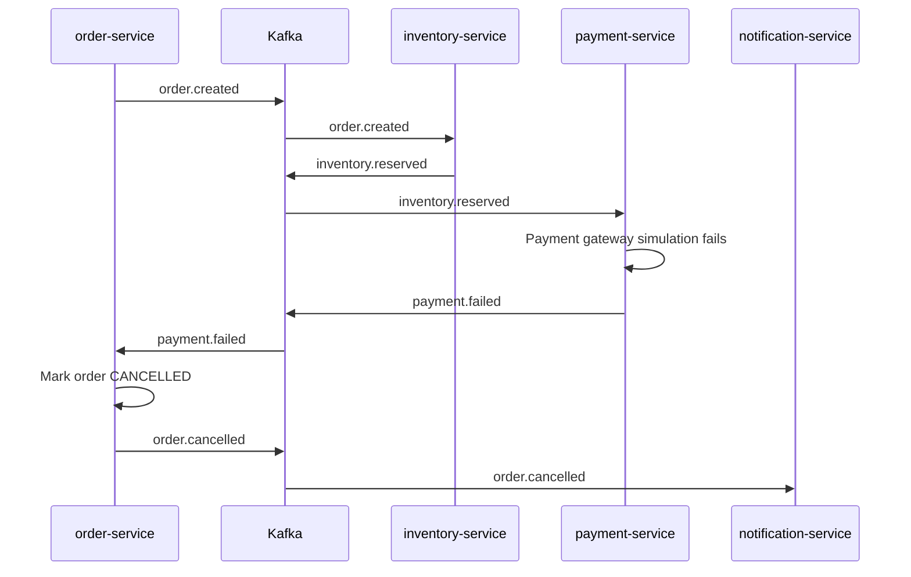

# SAGA Flow

The SAGA is event-driven through Kafka. `order-service` starts the flow by saving a pending order and publishing `order.created`.

## Happy Path

## Inventory Rejection

## Payment Failure

## Current Limitations

- `inventory.released` and `payment.refunded` exist as shared topic constants and event records, but compensation consumers/publishers are not wired yet.
- Payment uses a fixed dummy amount in the payment listener.
- Event handling is intentionally concise for assessment readability; production-grade idempotency, outbox, and dead-letter handling should be added before real deployment.
